# Hierarch — Architecture Overview

> **Hierarch** is an agentic automation platform that synthesizes workflows into executable code via **Harness Engineering.**.

> Describe your workflow in plain language — Hierarch designs the multi-agent architecture, determines each agent's execution strategy, and generates a production-ready program using **Harness Engineering**: every agent is compiled independently and assembled into a single, self-contained executable that runs your automation end-to-end.  
> You define the goal. Hierarch writes and runs the code.

> ⚠️ **Active development.** Server and client application are maintained in **private repositories**.  
> The same technology is currently **under patent examination**.  
> Inquiries: **hwansys@naver.com**

---

## Vision

Every day, people repeat the same tasks: checking news, researching markets, summarizing documents, monitoring competitors.  
Hierarch automates these recurring workflows — describe what you need once, and a team of AI agents handles it from then on.

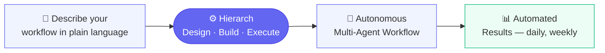

---

## Core Differentiators

| # | Feature | Description |
|---|---------|-------------|
| 1 | **Conversational Blueprint Design** | An AI architect conducts a structured interview to extract requirements and produces an executable workflow specification |
| 2 | **Automatic Execution Strategy** | Each agent's optimal execution mode (AI reasoning vs. deterministic code) is decided automatically at compile time |
| 3 | **Dynamic Code Synthesis** | The workflow specification is compiled into a runnable program on-the-fly — no static templates, no manual wiring |
| 4 | **Dual Execution Mode** | Run workflows on-demand locally, or schedule them on the cloud for fully hands-free automation |
| 5 | **Token Budget & Circuit Breaker** | Every run has a hard token spending limit — costs are predictable and capped |
| 6 | **Semantic Tool Discovery** | External MCP tools are discovered via embedding-based vector search and automatically bound to the agents that need them |

---

## How It Works

Hierarch operates as a **three-phase pipeline**: Design → Build → Execute.

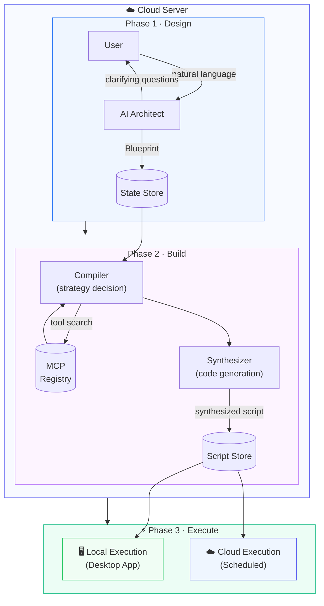

---

## Phase 1 — AI Architect (Design)

The platform begins with a **conversational interview**.  
The AI Architect asks targeted questions to understand the goal, data sources, constraints, and approval requirements — then produces a structured **Blueprint**.

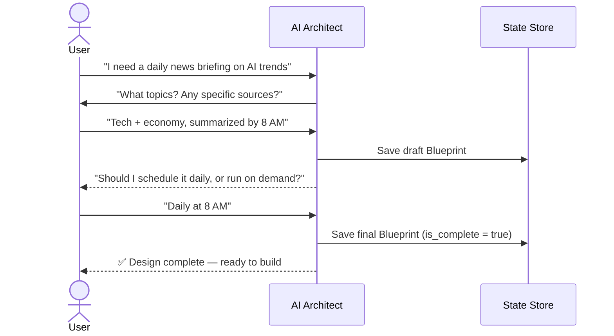

### Hierarchical Agent Structure

Every Blueprint step uses a **leader + sub-agent** team model:

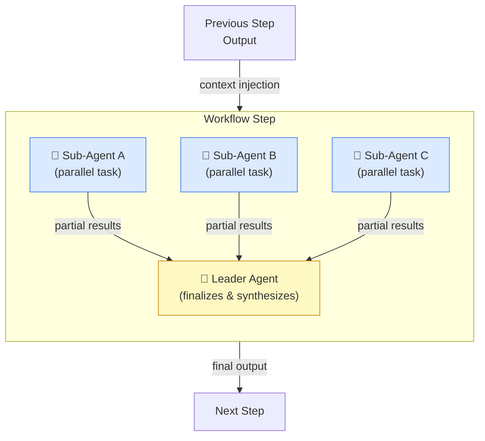

Sub-agents run **in parallel**. The leader receives all partial results and produces the step's final output, which flows into subsequent steps.

---

## Phase 2 — Compiler + Synthesizer (Build)

The Blueprint is transformed into a runnable program through two stages.

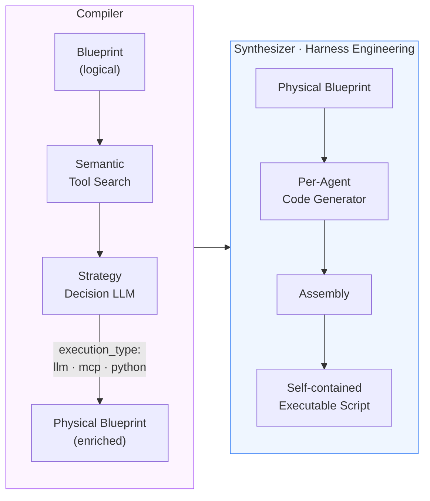

**Compiler decisions per agent:**

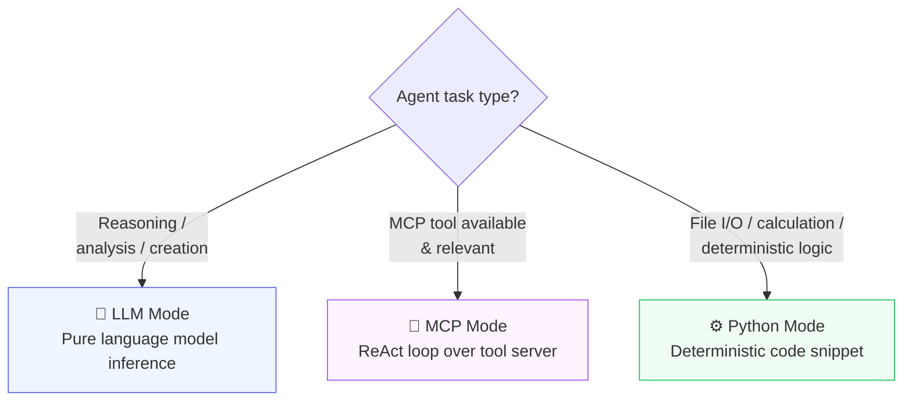

By deciding execution strategy at **compile time** rather than runtime, Hierarch avoids unnecessary LLM calls — deterministic tasks run as plain code, saving both cost and latency.

---

## Harness Engineering — Code Synthesis Strategy

### What is Agent Harness Engineering?

In conventional multi-agent frameworks (LangChain, AutoGen, CrewAI), a **harness** is the runtime scaffolding that wires agents together while the program is running.

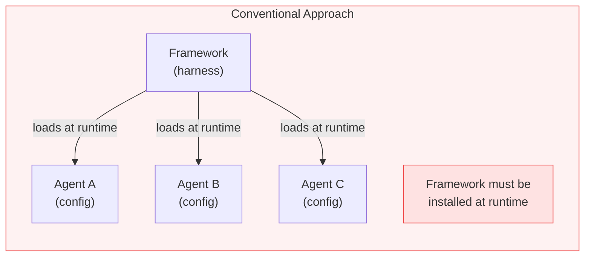

Agents are instances of framework classes, behavior is controlled by config passed at runtime, and the framework itself is always a runtime dependency.

---

### Hierarch's Approach — Harness as Code Generator

Hierarch inverts this model. The harness is used **only at build time** as a code generator. At runtime, the generated script is entirely self-contained — the harness package is never imported.

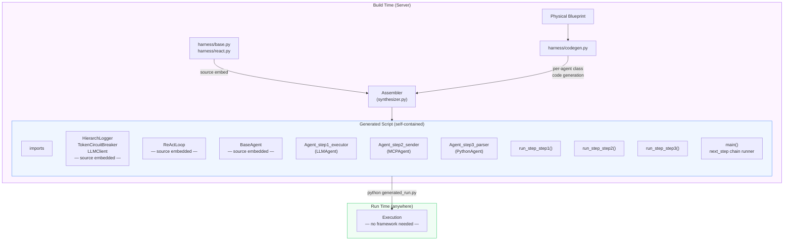

---

### Comparison

| Aspect | Conventional Harness | Hierarch Harness |
|--------|---------------------|-----------------|
| **Harness role** | Runtime orchestrator | Build-time code generator |
| **Agent definition** | Class instance + config dict | Generated class with logic baked in |
| **Framework at runtime** | Required | Not present |
| **Portability** | Needs framework installed | Any Python environment |
| **Agent code** | Shared template, differentiated by config | Each agent gets its own generated class |
| **Introspection** | Opaque — behavior hidden in framework | Transparent — all logic readable in one file |
| **Execution entry point** | Framework `.run()` method | Plain `python script.py` |
| **Modification** | Change config → re-run | Regenerate or edit script directly |

---

### Per-Agent Independent Code Generation

The key innovation is that **each agent's code is generated independently** from its compiled spec, then assembled into a single file.

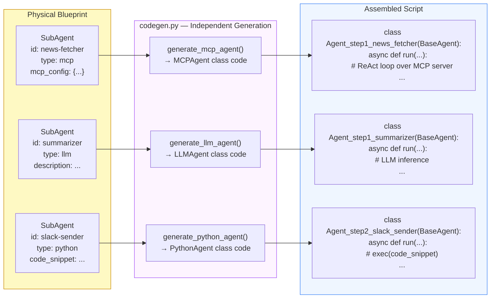

Because each agent class is generated independently, each one can be:
- **Reviewed** in isolation before the full script is deployed
- **Tested** independently by instantiating the class directly
- **Regenerated** individually if the compiled spec changes, without touching other agents

### MCP Tool Discovery

Hierarch maintains a **registry of external MCP servers** (sourced from Smithery).  
During compilation, agent descriptions are embedded and matched to relevant tools via vector similarity search.

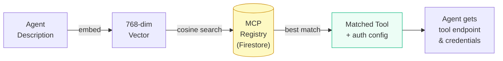

---

## Agent Execution — ReAct Loop

When an agent is bound to an MCP tool server, it does not call the tool blindly.  
Instead, it runs a **Planning → Tool Call → Observation → Re-plan** cycle until it has enough information to produce a final answer.

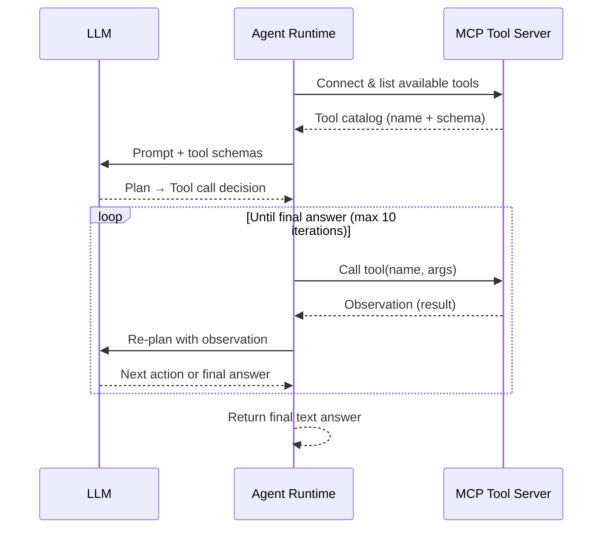

| Property | Detail |
|----------|--------|
| Tool discovery | Available tools are fetched live from the MCP server at runtime |
| Multi-turn | Full conversation history is preserved across iterations |
| Termination | Loop ends when the LLM produces a plain-text response with no tool call, or after max iterations |
| Fallback | If the MCP server is unreachable, the agent falls back to pure LLM inference |
| Parallelism | Multiple agents within the same workflow step run their ReAct loops concurrently |

---

## Phase 3 — Dual Execution Mode

Hierarch supports **two execution modes** from the same synthesized script. The script itself is environment-agnostic — it runs identically regardless of where it executes.

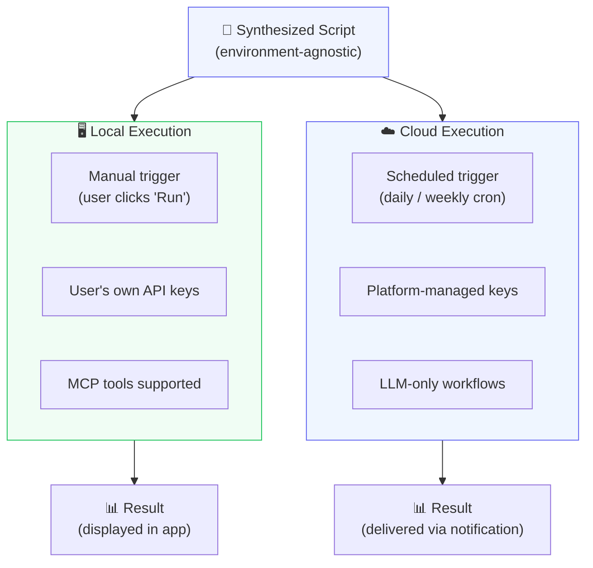

| | Local Execution | Cloud Execution |
|---|---|---|
| **Trigger** | Manual (click to run) | Scheduled (cron — daily, weekly, etc.) |
| **LLM API Key** | User's own key | Platform-managed |
| **MCP Tools** | ✅ Supported | LLM-only workflows |
| **Best for** | Testing, MCP workflows, privacy-sensitive tasks | Recurring automation — news, research, monitoring |

### Token Circuit Breaker

Every project sets a **maximum token budget** at design time.  
The circuit breaker monitors cumulative token consumption across all agents in real time — if the limit is exceeded, execution halts immediately, preventing runaway costs.

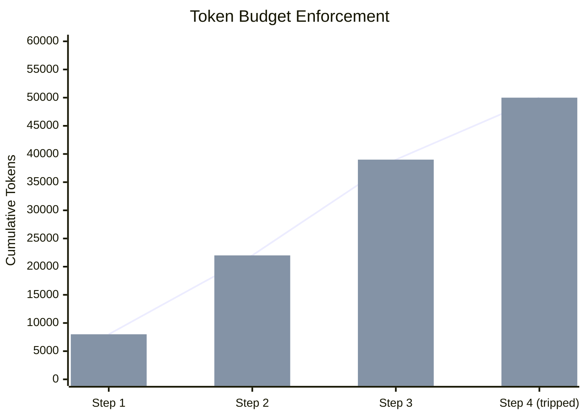

---

## Platform Access

Hierarch is accessible via **Web** and **Desktop App**, sharing the same interface.

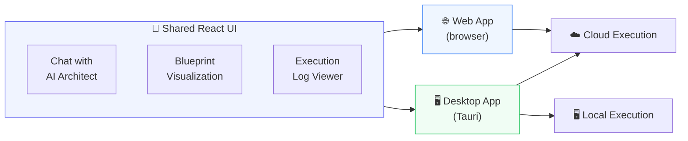

| | Web App | Desktop App |
|---|---|---|
| **Access** | Browser — no install | Download (Windows / macOS) |
| **Design & Build** | ✅ | ✅ |
| **Cloud Execution** | ✅ | ✅ |
| **Local Execution** | — | ✅ |
| **MCP Tools** | Cloud-supported tools only | All MCP tools |

The Web App provides **zero-friction onboarding** — try Hierarch instantly in the browser.  
The Desktop App adds **local execution** for users who want full control over their API keys and data.

---

## System Components

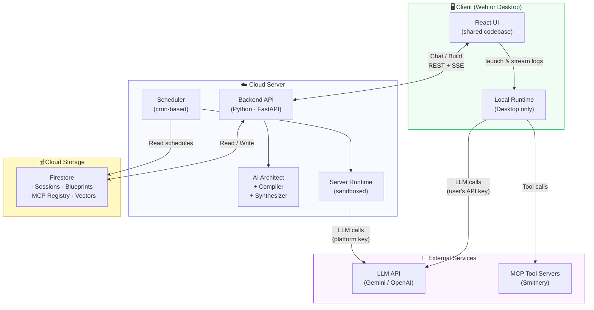

| Component | Technology | Responsibility |
|-----------|-----------|----------------|
| **Web / Desktop UI** | React (shared) · Tauri (desktop shell) | Chat UI · Blueprint visualization · Log display |
| **Backend Server** | Python · FastAPI · async SSE | Blueprint design · Compilation · Code synthesis · Scheduling |
| **Database** | Google Cloud Firestore | Sessions, blueprints, MCP registry, vector index |
| **Local Runtime** | Subprocess (inside Tauri) | Execute synthesized script · Token circuit breaker |
| **Server Runtime** | Subprocess (on server) | Scheduled execution · Token circuit breaker |

---

## Security Design

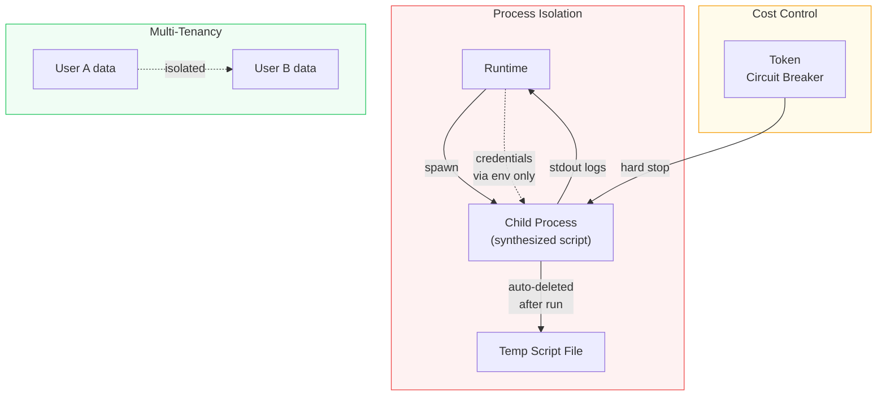

1. **Process Isolation** — each workflow runs in an isolated subprocess, separate from the host process
2. **Credential Scoping** — API keys are injected via environment variables and never persisted in scripts
3. **Automatic Cleanup** — temporary script files are deleted immediately after execution completes
4. **Token Budget** — per-project spending limits prevent runaway LLM costs
5. **User Isolation** — all cloud data is partitioned by user identity at the storage layer
6. **Local-first Privacy** — desktop users' API keys and data never pass through the server during execution

---

## Technology Stack

| Layer | Technology |
|-------|-----------|
| Web App | React |
| Desktop App | Tauri · Rust · React |
| API Server | Python · FastAPI · async SSE |
| AI / LLM | Google Gemini (multi-model) · LangChain |
| Embeddings | Gemini Embedding API · 768-dim vectors |
| Vector Search | Google Cloud Firestore native vector index |
| State Store | Google Cloud Firestore |
| Tool Ecosystem | MCP (Model Context Protocol) · Smithery Registry |
| Code Synthesis | Harness Engineering — per-agent independent code generation + assembly |
| Runtime | Isolated subprocess · token-aware circuit breaker |
| Scheduling | Cron-based scheduler (server-side) |

---

## Use Cases

| Use Case | Description | Execution |
|----------|-------------|-----------|
| 📰 **Daily News Briefing** | Summarize top news by category every morning | ☁️ Scheduled |
| 📊 **Market Research** | Monitor competitors and generate weekly trend reports | ☁️ Scheduled |
| 📄 **Paper Curation** | Find and summarize latest academic papers in your field | ☁️ Scheduled |
| 🎬 **Content Pipeline** | Automate YouTube production workflow from ideation to editing | 🖥️ Local (MCP) |
| 🔍 **Ad-hoc Research** | Deep-dive into a topic with multi-agent analysis | 🖥️ Local |

---

## Project Status

| Item | Status |
|------|--------|
| AI Architect (Design) | ✅ Complete |
| Compiler + Synthesizer (Build) | ✅ Complete |
| Desktop App (UI) | 🔧 In progress |
| Execution Engine | 🔧 In progress |
| Web App | 📋 Planned |
| Scheduling | 📋 Planned |
| Development | 🔧 Active development |
| Source code | 🔒 Private repositories (server + client app) |
| Patent | 📋 Under examination |

---

## Contact

Questions, collaboration, or licensing inquiries:

**✉️ hwansys@naver.com**

---

*Built with ❤️ by WhiteBearHands*
