# Hierarch — Architecture Overview

> **Hierarch** is a generative AI agent orchestration platform that transforms natural language requirements into fully autonomous, multi-agent workflows — no code required.

> ⚠️ **Active development.** Server and client application are maintained in private repositories.  
> The same technology is currently **under patent examination**.  
> Inquiries: **hwansys@naver.com**

---

## Vision

Traditional automation requires engineers to write, deploy, and maintain complex pipelines.  
Hierarch eliminates that gap: describe what you need in plain language, and the platform designs, builds, and runs a team of AI agents to accomplish it.

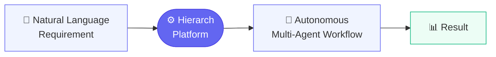

---

## Core Differentiators

| # | Feature | Description |
|---|---------|-------------|
| 1 | **Conversational Blueprint Design** | An AI architect conducts a structured interview to extract requirements and produces an executable workflow specification |
| 2 | **Automatic Execution Strategy** | Each agent's optimal execution mode (AI reasoning vs. deterministic code) is decided automatically at compile time |
| 3 | **Dynamic Code Synthesis** | The workflow specification is compiled into a runnable program on-the-fly — no static templates, no manual wiring |
| 4 | **Isolated Execution + Token Budget** | Each run is sandboxed in an isolated process with a hard token spending limit to guarantee cost control |
| 5 | **Semantic Tool Discovery** | External MCP tools are discovered via embedding-based vector search and automatically bound to the agents that need them |

---

## System Architecture

Hierarch operates as a **three-phase pipeline**: Design → Build → Execute.

> **Key principle:** Design and code synthesis happen on the **server**. Execution happens **locally on the user's machine** via the desktop client app.

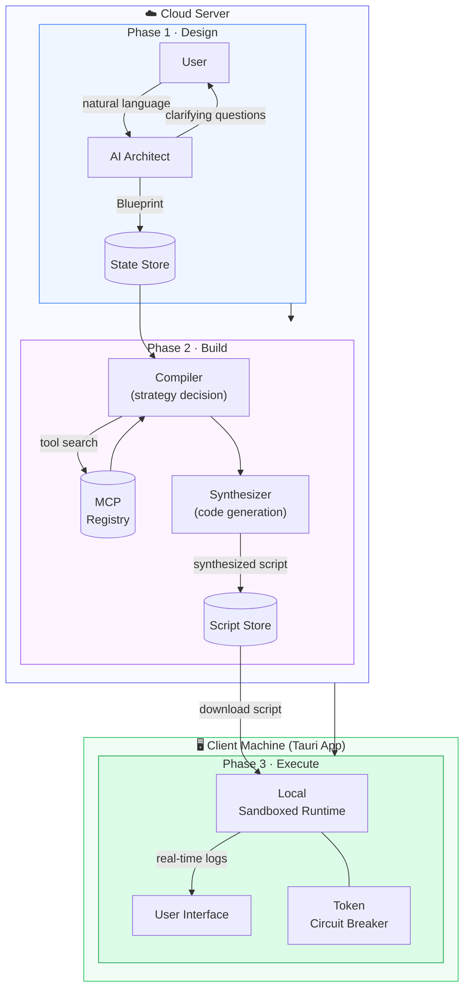

---

## Phase 1 — AI Architect (Design)

The platform begins with a **conversational interview**.  
The AI Architect asks targeted questions to understand the goal, data sources, constraints, and approval requirements — then produces a structured **Blueprint**.

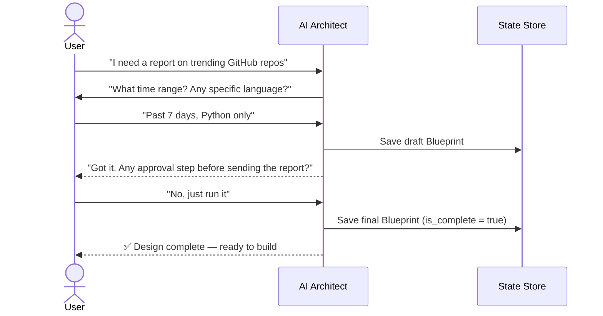

### Hierarchical Agent Structure

Every Blueprint step uses a **leader + sub-agent** team model:

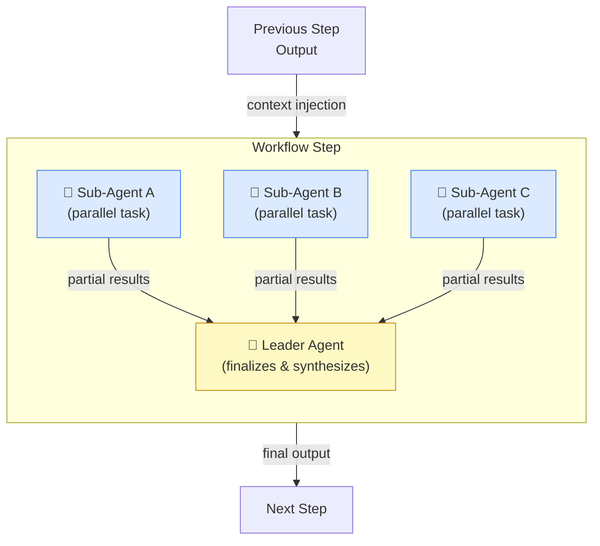

Sub-agents run **in parallel**. The leader receives all partial results and produces the step's final output, which flows into subsequent steps.

---

## Phase 2 — Compiler + Synthesizer (Build)

The Blueprint is transformed into a runnable program through two stages.

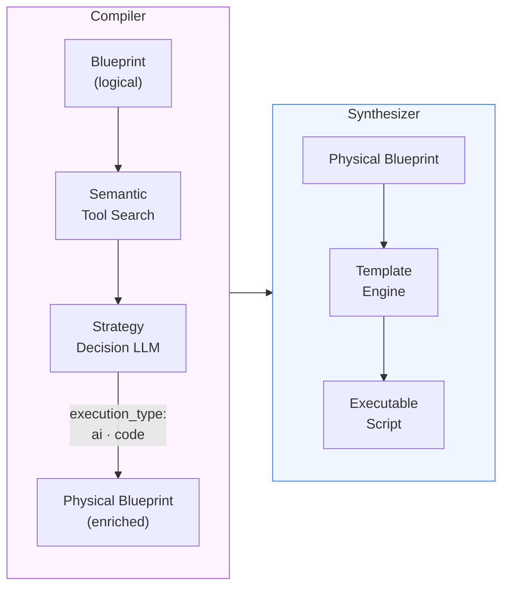

**Compiler decisions per agent:**

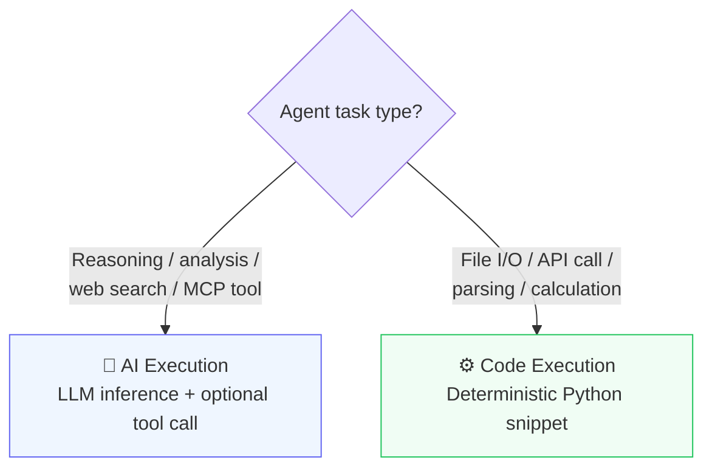

### MCP Tool Discovery

Hierarch maintains a **registry of external MCP servers** (sourced from Smithery).  
During compilation, agent descriptions are embedded and matched to relevant tools via vector similarity search.

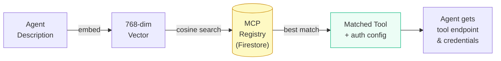

---

## Phase 3 — Runtime (Execute)

The synthesized script is **downloaded to the user's machine** and executed locally inside the Tauri desktop app.  
All LLM API calls and MCP tool connections originate from the **client**, keeping user credentials entirely off the server.

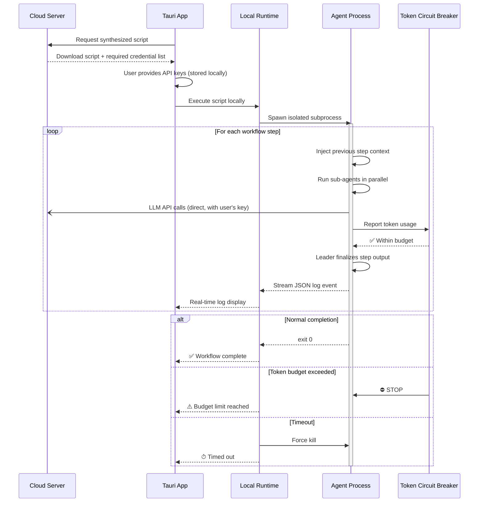

### Token Circuit Breaker

Every project sets a **maximum token budget** at design time.  
The circuit breaker monitors cumulative token consumption across all agents in real time — if the limit is exceeded, execution halts immediately, preventing runaway costs.

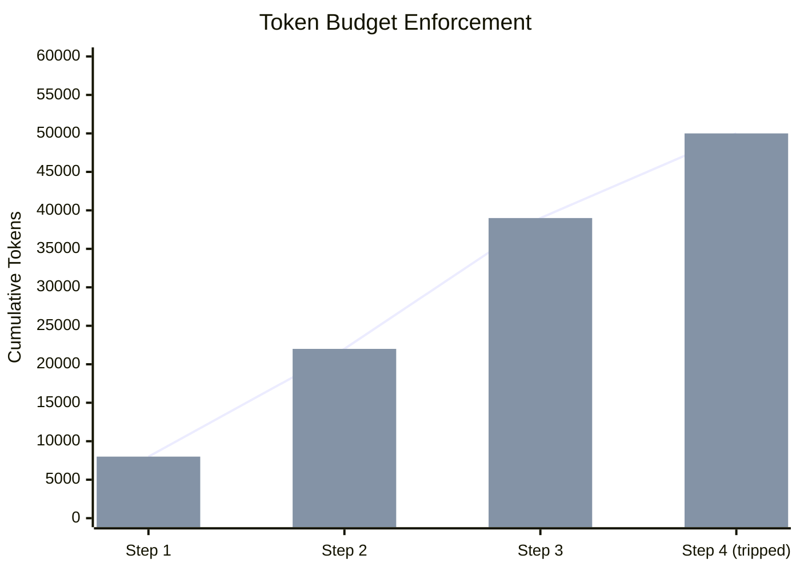

---

## API Interface

All interactions are available via a simple REST + SSE API.

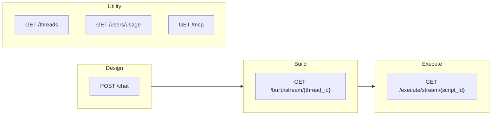

| Phase | Endpoint | Transport | Description |
|-------|----------|-----------|-------------|
| Design | `POST /chat` | SSE stream | Conversational blueprint design |
| Build | `GET /build/stream/{id}` | SSE stream | Real-time compile + code synthesis |
| Execute | `GET /execute/stream/{id}` | SSE stream | Sandboxed workflow execution |
| — | `GET /threads` | REST | List user sessions |
| — | `GET /users/usage` | REST | Token consumption tracking |
| — | `GET /mcp` | REST | Available MCP tool catalog |

---

## System Components

Hierarch is composed of three independently managed components.  
The division of responsibility between server and client is intentional: **heavy AI work on the server, execution on the user's machine**.

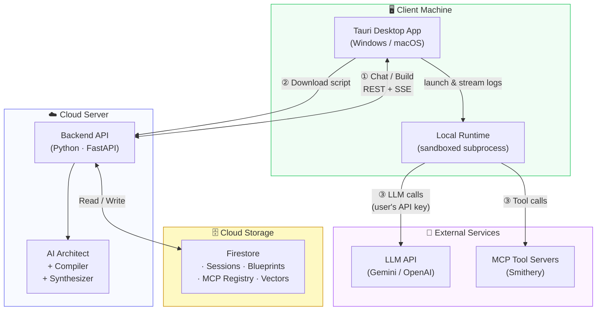

| Component | Technology | Responsibility |
|-----------|-----------|----------------|
| **Desktop App** | Tauri (Rust + WebView) | Chat UI · Build trigger · Script execution · Log display |
| **Backend Server** | Python · FastAPI | Blueprint design · Compilation · Code synthesis |
| **Database** | Google Cloud Firestore | Sessions, blueprints, MCP registry, vector index |
| **Local Runtime** | Subprocess (inside Tauri) | Execute synthesized script · Token circuit breaker |

### Why run locally?

- **Privacy** — user API keys and data never pass through the server during execution
- **Flexibility** — users can connect to any LLM provider or local model
- **No server cost** — LLM inference costs go directly from user to provider

---

## Technology Stack

| Layer | Technology |
|-------|-----------|
| Desktop App | Tauri · Rust |
| API Server | Python · FastAPI · async SSE |
| AI / LLM | Google Gemini (multi-model) · LangChain |
| Embeddings | Gemini Embedding API · 768-dim vectors |
| Vector Search | Google Cloud Firestore native vector index |
| State Store | Google Cloud Firestore |
| Tool Ecosystem | MCP (Model Context Protocol) · Smithery Registry |
| Code Synthesis | Template-based dynamic program generation |
| Runtime | Isolated subprocess · token-aware circuit breaker |

---

## Security Design

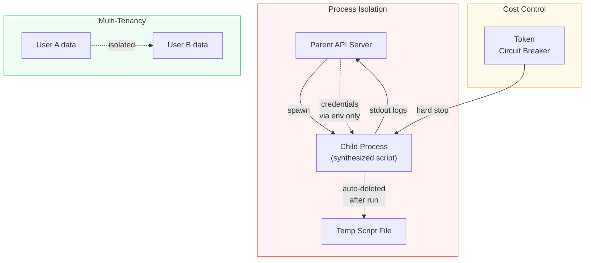

1. **Local Execution** — synthesized code runs entirely on the user's machine; the server never executes user workloads
2. **Credential Scoping** — API keys are stored and used locally in the desktop app, never transmitted to the server
3. **Process Isolation** — each workflow runs in an isolated subprocess inside the Tauri app, separate from the UI process
4. **Automatic Cleanup** — temporary script files are deleted immediately after execution completes
5. **Token Budget** — per-project spending limits are enforced locally, preventing runaway LLM costs
6. **User Isolation** — all cloud data is partitioned by user identity at the storage layer

---

---

## Project Status

| Item | Status |
|------|--------|
| Development | 🔧 Active development |
| Source code | 🔒 Private repositories (server + client app) |
| Patent | 📋 Under examination (same technology) |

---

## Contact

Questions, collaboration, or licensing inquiries:

**✉️ hwansys@naver.com**

---

*Built with ❤️ by WhiteBearHands*
